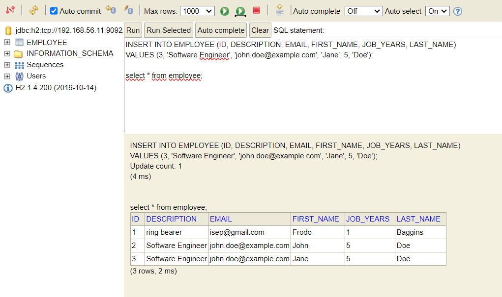
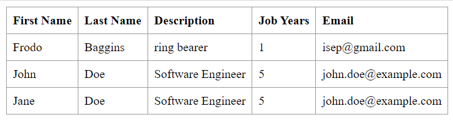

# Technical Report for CA3-Part2

## Introduction

This is a technical report for de Class Assignment 3 - Part 2, of the DevOps class from the "Switch - Curso de Especialização em Desenvolvimento de Software" made by Simão Campos, student nº 1231859.

The following report is a technical document that provides a detailed account of the steps taken to complete the assignment, including the commands used, the issues encountered, and the solutions implemented. The tutorial section provides a step-by-step guide to the assignment tasks.

After installing the Ubuntu 20.04.3 LTS on the Virtual Box, the following steps were taken to complete the assignment:

### 1. Pre-requisites

- The repository must be public
- Install Vagrant
- Install VirtualBox
- Open VirtualBox
- Run `vagrant init` on the folder where we want to create the project, in this case the folder CA3-Part2

### 2. Change Vagrantfile

- change the Vagrantfile to the given by the teacher on the CA3-Part2 repository
- change the ubuntu version to 20.04.3, where it reads "ubuntu/bionic64" to "generic/ubuntu2004", this happens three time in the script.

### 3. Change the timout period

- On my case the script was taking too long to run, it got stuck on the "==> default: Waiting for SSH to become available..." message. So I added a timeout to the script, so it would not take too long to run.

### 4.Change JPA from 11 to 17

- On the Vagrantfile, change the JPA version from 11 to 17, where it reads "openjdk-11-jdk-headless" to "openjdk-17-jdk-headless"

### 5. Change the git clone and added commands to run the application
Changed the git clone to my gitHub public repository.
After the clean build, added gradlew bootRun to start the application.

```bash
git clone https://github.com/simao-campos87/devops-23-24-JPE-1231859.git
cd devops-23-24-JPE-1231859/CA2/part2/react-and-spring-data-rest-basic
chmod u+x gradlew
./gradlew clean build
./gradlew bootRun
```

### 6. Edit the H2 database configurations, so the project can read from the db and show the entries on the web page.
Following the commits on the repository, we can see the changes made to the project.
Edit the application.properties file on the CA2-part2 project to use the H2 database, so the project can run from it.
```bash
server.servlet.context-path=/basic-0.0.1-SNAPSHOT
spring.data.rest.base-path=/api
#spring.datasource.url=jdbc:h2:mem:jpadb
## In the following settings the h2 file is created in /home/vagrant folder
spring.datasource.url=jdbc:h2:tcp://192.168.56.11:9092/./jpadb
spring.datasource.driverClassName=org.h2.Driver
spring.datasource.username=sa
spring.datasource.password=
spring.jpa.database-platform=org.hibernate.dialect.H2Dialect
# So that spring will no drop de database on every execution.
spring.jpa.hibernate.ddl-auto=update
spring.h2.console.enabled=true
spring.h2.console.path=/h2-console
spring.h2.console.settings.web-allow-others=true
```
Edit app.js file
```bash
(...)
client({method: 'GET', path: '/basic-0.0.1-SNAPSHOT/api/employees'}).done(response => {
(...)
```
Edit the index.html file on the templates folder
```bash
(...)
<link rel="stylesheet" href="main.css" />
  ```
Commit to the remote repository the changes made to the project.

To access the H2 database, we need to access the address: http://192.168.56.11:8082.

On the H2 console, on JDBC URL, insert the following: `jdbc:h2:tcp://192.168.56.11:9092/./jpadb`.
The remaining fields are the default ones.




Using the `select * from entry;` command, we can see the entries on the database.
Using the insert command, we can insert new entries on the database.

### 6. Run the project
Run the project with the command `vagrant up`.

If not working, run `vagrant destroy`, to delete the machines and then `vagrant up`.
On the web browser, access the address `http://192.168.56.10:8080/basic-0.0.1-SNAPSHOT/` to verify application working. This address is defined on the Vagrantfile from the 'web' machine.


### 7. Stop the project
To stop the project, run the command `vagrant halt`.

### 8. Reload/Restart the project
To destroy the project, run the command `vagrant reload`.

## Alternative to Virtual box

I made a Vagrantfile to run using Qemu, the main differences are written next:

```bash
config.vm.define "db" do |db|
    db.vm.box = "generic/ubuntu2004"
    db.vm.hostname = "db"

    db.vm.provider "qemu" do |qe|
      qe.arch = "x86_64"
      qe.machine = "q35"
      qe.cpu = "host"
      qe.memory = "512"
    end
```

The main difference using Qemu is that vagrant doesn't download the machine image. I added a script to download the image and then run the vagrant up command.

```bash
 config.vm.provision "shell", run: 'once', inline: <<-SHELL
    if [ ! -f ubuntu2004.img ]; then
      wget https://cloud-images.ubuntu.com/focal/current/focal-server-cloudimg-amd64.img -O ubuntu2004.img
    fi
  SHELL
```
The remaining steps are the same as the VirtualBox.


