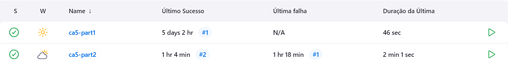

# Technical Report for CA5

## Introduction

This is a technical report for de Class Assignment 5, of the DevOps class from the "Switch - Curso de Especialização em Desenvolvimento de Software" made by Simão Campos, student nº 1231859.

The following report is a technical document that provides a detailed account of the steps taken to complete the assignment, including the commands used, the issues encountered, and the solutions implemented. The tutorial section provides a step-by-step guide to the assignment tasks.

### Configure jenkins

1. intall jenkins from the .war file with the following command:
    
```bash
  java -jar jenkins.war --httpPort=9090
```
2. Access the jenkins at http://localhost:9090
3. Configure account and password
4. Install the suggested plugins
5. The gradlew file could need to be updated. If the pipeline breaks with a not recognizing "chmod +x ./gradlew" error, the following command must be run:
```bash
./gradlew wrapper --gradle-version 8.6
```
This could apply to both exercises.

### 1. Exercise 1

1. Create at the CA2-part1 folder a file named Jenkinsfile, to perform the steps of the exercise, with the following content:

```bash
pipeline {
agent any
stages {
    stage('Checkout') {
            steps {
                echo 'Checking out the code from the repository'
                git branch: 'main', url: 'https://github.com/simao-campos87/devops-23-24-JPE-1231859.git'
            }
        }
    stage('Assemble') {
            steps {
                echo 'Assembling...'
                dir('CA2/part1/gradle_basic_demo') {
                     sh 'chmod +x ./gradlew'
                     sh './gradlew clean assemble'
                }
            }
        }
    stage('Test') {
            steps {
                echo 'Testing...'
                dir('CA2/part1/gradle_basic_demo') {
                    sh './gradlew test'
                    junit 'build/test-results/test/*.xml'
                }
            }
        }
    stage('Archive') {
            steps {
                echo 'Archiving...'
                dir('CA2/part1/gradle_basic_demo') {
                    archiveArtifacts 'build/libs/*.jar'
                }
            }
        }
    }
}
```
Commit the Jenkinsfile to the repository.

2. Create a new item in jenkins with the following steps:
    - Click on "New Item"
    - Enter the item name (ca2-part1 for the example)
    - Select "Pipeline" and click "OK"
    - In the "Pipeline" section, select "Pipeline script from SCM"
    - Choose Git as the SCM
    - In the "Repository URL" field, enter the URL of the repository
    - The repository is public so the pipeline can be accessed without authentication
    - The branch is main
    - In the "Script Path" field, enter the path to the Jenkinsfile, specific to the repository
    - Click "Save"

3. Run the pipeline by clicking on "Build Now"
4. Check the results of the pipeline (if successful, the build should be green)

### 2. Exercise 2

1. For the second exercise, new plugins need to be installed in Jenkins. The plugins are:
    - Docker API Plugin
    - Docker Commons Plugin
    - Docker plugin
    - Docker pipeline
    - HTML Publisher plugin

To do this go to "Manage Jenkins" -> "Manage Plugins" -> "Available" and search for the plugins. Select the plugins and click "Install without restart".

2. Create an environment variable in Jenkins to store the Docker Hub credentials:
    - Go to "Manage Jenkins" -> "Manage Credentials" -> "Jenkins" -> "Global credentials" -> "Add Credentials"
    - Select "Username with password" as the kind of credentials
    - Enter the username and password for Docker Hub
    - Enter an ID for the credentials (e.g., docker-hub-credentials)
    - Click "OK"

3. Create at the CA2-part2 folder a file named Jenkinsfile, to perform the steps of the exercise, with the following content:

```bash
pipeline {
    agent any

    environment {
        DOCKER_CREDENTIALS_ID = 'docker-hub-credentials'
        DOCKER_IMAGE = '1231859/ca2-part2-jenkins'
        DOCKER_TAG = "${env.BUILD_ID}"
    }

    stages {
        stage('Checkout') {
             steps {
                 echo 'Checking out code from the repository'
                 git branch: 'main', url: 'https://github.com/simao-campos87/devops-23-24-JPE-1231859.git'
               }
        }

        stage('Set Permissions') {
            steps {
                dir('ca2/part2/react-and-spring-data-rest-basic') {
                    echo 'Setting executable permissions on gradlew...'
                    sh 'chmod +x gradlew'
                }
            }
        }

        stage('Assemble') {
            steps {
                retry(3) {
                    dir('ca2/part2/react-and-spring-data-rest-basic') {
                        echo 'Assembling the application...'
                        sh './gradlew assemble'
                    }
                }
            }
        }

        stage('Test') {
            steps {
                dir('ca2/part2/react-and-spring-data-rest-basic') {
                    echo 'Running unit tests...'
                    sh './gradlew test'
                }
            }
        }

        stage('Javadoc') {
            steps {
                dir('ca2/part2/react-and-spring-data-rest-basic') {
                    echo 'Generating Javadoc...'
                    sh './gradlew javadoc'
                    publishHTML(target: [
                        allowMissing: false,
                        alwaysLinkToLastBuild: false,
                        keepAll: true,
                        reportDir: 'build/docs/javadoc',
                        reportFiles: 'index.html',
                        reportName: 'Javadoc'
                    ])
                }
            }
        }

        stage('Archive') {
            steps {
                dir('ca2/part2/react-and-spring-data-rest-basic') {
                    echo 'Archiving artifacts...'
                    archiveArtifacts artifacts: 'build/libs/*.jar', fingerprint: true
                }
            }
        }

        stage('Create Dockerfile') {
            steps {
                dir('ca2/part2/react-and-spring-data-rest-basic') {
                    script {
                        def dockerfileContent = """
                        FROM gradle:jdk21
                        WORKDIR /app
                        COPY build/libs/*.jar app.jar
                        EXPOSE 8080
                        ENTRYPOINT ["java", "-jar", "app.jar"]
                        """
                        writeFile file: 'Dockerfile', text: dockerfileContent
                    }
                }
            }
        }

        stage('Publish Image') {
            steps {
                script {
                    echo 'Building and publishing Docker image...'
                    docker.withRegistry('https://index.docker.io/v1/', "${DOCKER_CREDENTIALS_ID}") {
                        dir('ca2/part2/react-and-spring-data-rest-basic') {
                            def customImage = docker.build("${DOCKER_IMAGE}:${DOCKER_TAG}")
                            customImage.push()
                            customImage.push('latest')
                        }
                    }
                }
            }
        }

        stage('Run Container') {
            steps {
                script {
                    echo 'Running Docker container...'
                    sh "docker run -d -p 8080:8080 ${DOCKER_IMAGE}:latest"
                }
            }
        }
    }
}
```

Commit the Jenkinsfile to the repository.

4. Open docker desktop and login to docker hub.

5. Create a new item in jenkins with the following steps:
    - Click on "New Item"
    - Enter the item name (ca2-part2 for the example)
    - Select "Pipeline" and click "OK"
    - In the "Pipeline" section, select "Pipeline script from SCM"
    - Choose Git as the SCM
    - In the "Repository URL" field, enter the URL of the repository
    - The repository is public so the pipeline can be accessed without authentication
    - The branch is main
    - In the "Script Path" field, enter the path to the Jenkinsfile, specific to the repository
    - Click "Save"

6. Run the pipeline by clicking on "Build Now"
7. Check the results of the pipeline (if successful, the build should be green)


8. Check the docker hub for the image created
9. Check the docker desktop for the container running
10. Access the application at http://localhost:8080/basic-0.0.1-SNAPSHOT
11. The machines can be verified at the Docker Hub at the following addresses: The image is now available at https://hub.docker.com/r/1231859
